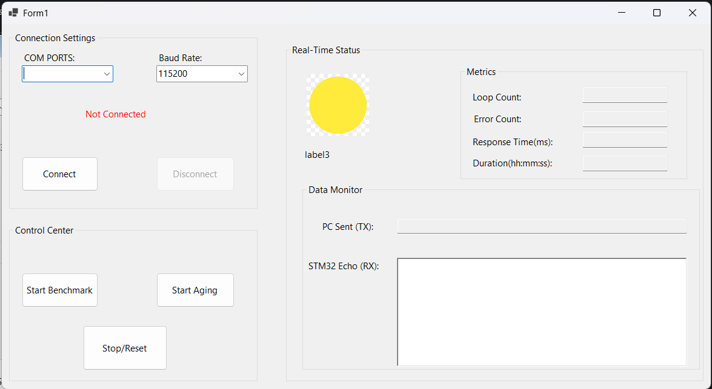
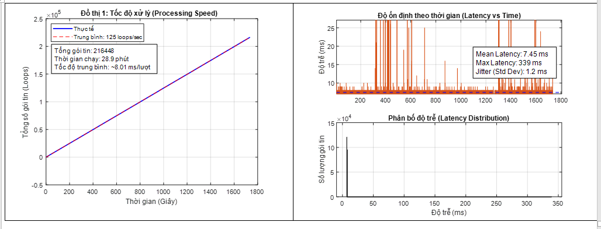

# STM32 UART Benchmark

## Overview

This project benchmarks UART communication performance between a Windows PC and an STM32F103C8T6 microcontroller.

The objective is to evaluate communication throughput, latency, reliability, and long-term stability under continuous high-frequency data transmission.

A Windows Forms application repeatedly exchanges data with the STM32 and records communication statistics in real time.

---

## Hardware

### Devices

* STM32F103C8T6 Blue Pill
* USB-to-TTL Converter
* Windows PC

### Communication Parameters

* UART Baud Rate: 115200 bps
* Data Format: 8N1
* Communication Mode: Interrupt-Based UART
* STM32 HAL Driver: `HAL_UART_Receive_IT()`

---

## Software

### STM32 Side

* STM32CubeIDE
* STM32 HAL Library
* Interrupt-Based UART Reception

### PC Side

* Visual Studio
* C# Windows Forms
* Real-Time Performance Monitoring

---

## Objectives

The benchmark evaluates:

* UART Throughput
* Communication Latency
* Data Integrity
* Long-Term Stability
* Error Rate

---

## Communication Mechanism

The PC continuously sends test packets to the STM32.

After receiving a packet, the STM32 immediately returns the response packet.

The benchmark software verifies:

* Packet correctness
* Response time
* Throughput
* Error count

---

## System Architecture

```text
Windows Application
        │
        │ UART
        ▼
STM32F103C8T6
        │
        │ Echo Response
        ▼
Windows Application
```

---

## Benchmark Metrics

### Throughput

Measures the amount of successfully transmitted data per second.

```text
Throughput = Total Bytes / Execution Time
```

### Latency

Measures round-trip response time.

```text
Latency = Receive Time - Send Time
```

### Accuracy

Measures the percentage of correctly received packets.

```text
Accuracy (%) =
Successful Packets / Total Packets × 100
```

### Stability

Evaluates communication consistency during prolonged operation.

---

## Benchmark Configuration

### Test Conditions

* Continuous communication
* High-frequency packet transmission
* Long-duration execution
* Real-time statistics collection

### Test Duration

Approximately 29 minutes

### Total Iterations

216,416 communication cycles

---

## Benchmark Results

| Metric           | Result     |
| ---------------- | ---------- |
| Total Iterations | 216,416    |
| Average Latency  | 8.01 ms    |
| Throughput       | 6.5 KB/s   |
| Error Count      | 0          |
| Accuracy         | 100%       |
| Test Duration    | 29 minutes |

---

## Performance Analysis

The benchmark completed more than 216,000 communication cycles without any detected communication errors.

The measured throughput remained stable throughout the entire test period.

No packet corruption or communication interruptions were observed.

The average latency remained within the expected range for UART communication through a USB-to-TTL interface and a Windows desktop application.

---

## Reliability Assessment

The communication system demonstrated:

* Stable interrupt-driven UART reception
* Consistent response timing
* Reliable long-term operation
* Zero communication failures during testing

These results indicate that the communication architecture is suitable for continuous data exchange applications.

---

## Skills Demonstrated

* STM32 Embedded Programming
* UART Communication
* Interrupt-Based Reception
* Performance Benchmarking
* Throughput Measurement
* Latency Analysis
* Stress Testing
* Data Validation
* Windows Forms Development

---

## Demonstration

### Benchmark Application



### Benchmark Result



### STM32 Hardware Setup


---

## Future Improvements

### STM32 Firmware

* DMA-based UART Reception
* Circular Buffer Implementation
* Error Recovery Mechanisms

### PC Application

* Real-Time Graph Visualization
* Export Benchmark Reports
* Multi-Port Testing

---

## Author

Phan Duc Hung

Ho Chi Minh City University of Technology (HCMUT)

Control and Automation Engineering

---

## Conclusion

The benchmark successfully evaluated the performance of UART communication between a Windows PC and an STM32F103C8T6 microcontroller.

The system achieved stable throughput, low latency, and zero communication errors during prolonged operation, demonstrating reliable communication performance for embedded system applications.

