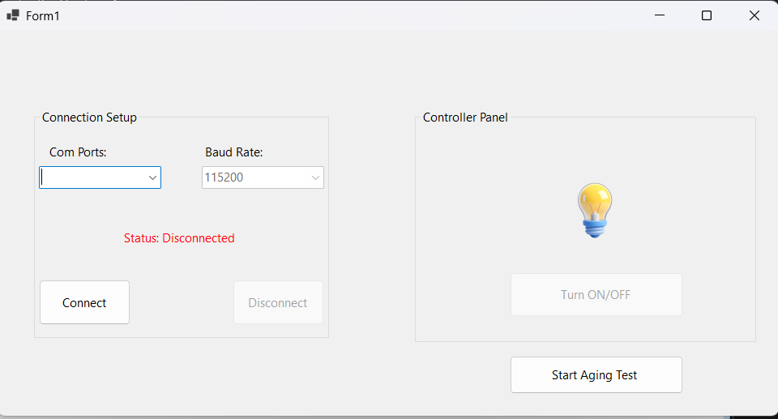
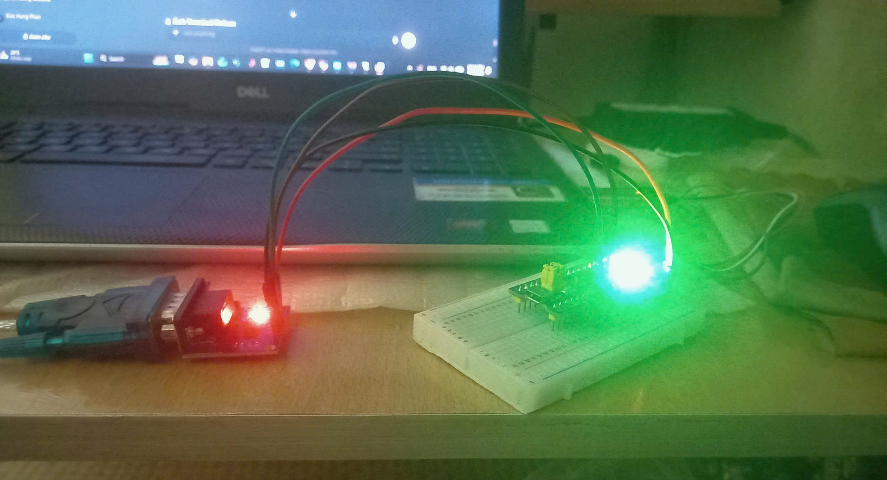
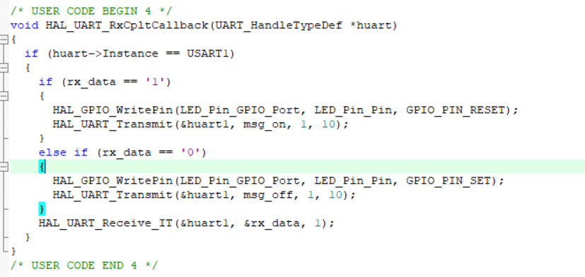

# UART LED Control using STM32

## Overview

This project implements a UART-based communication system between a PC and an STM32 microcontroller.

The STM32 receives commands from a serial terminal running on the PC and controls onboard LEDs according to the received commands.

The project demonstrates the fundamentals of UART communication, command parsing, and peripheral control in embedded systems.

---

## Objectives

- Understand UART communication on STM32.
- Implement serial communication between PC and MCU.
- Process user commands received through UART.
- Control GPIO outputs using UART commands.
- Learn embedded debugging and testing techniques.

---
## Hardware

### Microcontroller

- STM32F103C8T6 Blue Pill

### Onboard Peripheral

- Built-in status LED connected to PC13 (Active-Low)

### Communication Interface

- USART1 UART Communication

## System Workflow

```text
PC Terminal
     │
     │ UART Command
     ▼
STM32 UART Receive
     │
     ▼
Command Parser
     │
     ├──── LED_ON
     │        │
     │        ▼
     │   PC13 = LOW
     │
     ├──── LED_OFF
     │        │
     │        ▼
     │   PC13 = HIGH
     │
     └──── STATUS
              │
              ▼
       Send Status Back
```
---
## Notes

The onboard LED connected to PC13 is active-low.

| GPIO State | LED State |
|------------|------------|
| RESET | ON |
| SET | OFF |

This behavior is caused by the hardware design of the STM32F103C8T6 Blue Pill board.
---

## Software

- STM32CubeMX
- Keli uVision
- STM32 HAL Drivers
- Serial Terminal (Tera Term / PuTTY / Hercules)
- Visual Studio
- C Programming Language
---

## Features

- UART Receive
- UART Transmit
- Command Parsing
- LED ON/OFF Control
- Serial Feedback Messages

---
## Communication Method

UART reception is implemented using interrupt-driven communication through the STM32 HAL library.

The project uses:

```c
HAL_UART_Receive_IT(...)
```

instead of polling-based reception.

When a UART frame is received, an interrupt is triggered and the received command is processed inside the callback function.

This approach improves CPU efficiency because the microcontroller does not need to continuously poll the UART peripheral.
---
## UART Configuration

| Parameter | Value |
|------------|------------|
| Peripheral | USART1 |
| Baud Rate | 115200 |
| Data Bits | 8 |
| Stop Bits | 1 |
| Parity | None |
| Communication Mode | Interrupt-Based |
| HAL Function | HAL_UART_Receive_IT() |
---
## Command Structure

The STM32 receives text commands through UART.

### Available Commands

| Command | Function |
|----------|----------|
| LED_ON | Turn LED ON |
| LED_OFF | Turn LED OFF |
| STATUS | Return LED Status |

---

## System Workflow

```text
PC Terminal
     │
     │ UART Command
     ▼
STM32 UART Receive
     │
     ▼
Command Parser
     │
     ├──── LED_ON
     │        │
     │        ▼
     │    LED ON
     │
     ├──── LED_OFF
     │        │
     │        ▼
     │    LED OFF
     │
     └──── STATUS
              │
              ▼
      Send Status Back
```

---

## Software Architecture

```text
System Startup
      │
      ▼
Initialize GPIO
      │
      ▼
Initialize USART1
      │
      ▼
Enable UART Interrupt
      │
      ▼
HAL_UART_Receive_IT()
      │
      ▼
Wait for UART Interrupt
      │
      ▼
HAL_UART_RxCpltCallback()
      │
      ▼
Parse Command
      │
      ▼
Control PC13 LED
```
---

## Source Code Structure

```text
UART_LED_Control
│
├── Core
│   ├── Inc
│   └── Src
│
├── Drivers
│
├── Images
│
└── README.md
```

---

## Demonstration

### PC Application



### STM32 Hardware



### Interrupt-Based Reception


---

## Testing Results

| Test Case | Result |
|------------|------------|
| LED_ON | Passed |
| LED_OFF | Passed |
| STATUS | Passed |
| Invalid Command | Passed |

---

## Challenges

During implementation several issues were encountered:

- Incorrect UART baud rate configuration.
- Missing line termination characters.
- Command parsing errors.
- Serial buffer management.

These issues were solved through debugging and serial monitoring.

---

## My Contributions

- Configured USART1 communication.
- Implemented interrupt-based UART reception using HAL_UART_Receive_IT().
- Developed command parsing logic.
- Implemented LED control through PC13.
- Tested communication reliability between STM32 and PC.
- Debugged UART interrupt handling and buffer management.
---

## Future Improvements

Possible future extensions:

- Multiple LED control.
- PWM brightness adjustment.
- UART interrupt-based communication.
- Menu-driven serial interface.
- PC graphical control application.

---

## Author

Phan Duc Hung

Ho Chi Minh City University of Technology (HCMUT)

Control and Automation Engineering
