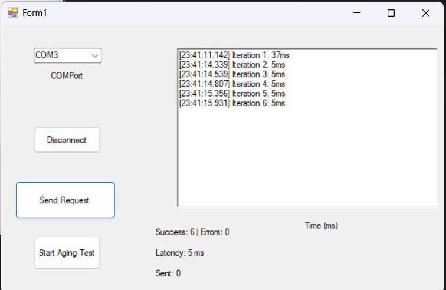
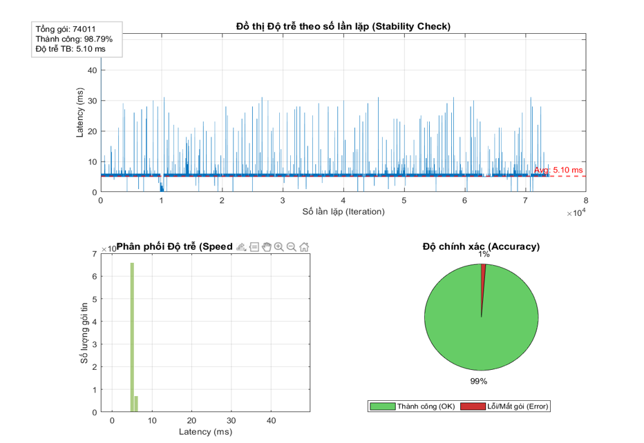
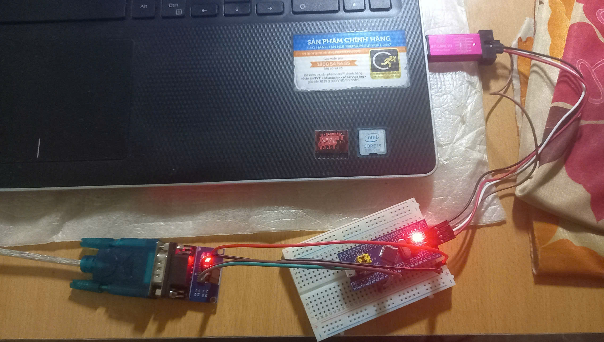

# UART Latency Test using STM32

## Overview

This project evaluates the communication latency between a Windows PC and an STM32F103C8T6 microcontroller using UART communication.

A Windows Forms application continuously exchanges data with the STM32 through a USB-to-UART interface. The round-trip response time is measured and recorded to analyze communication performance, reliability, and long-term stability.

The objective is to determine whether the communication system can maintain low latency and stable operation during prolonged stress testing.

---

## Hardware

### Devices

* STM32F103C8T6 Blue Pill
* USB-to-TTL Converter
* Windows PC

### Communication Parameters

* UART Baud Rate: 115200 bps
* Data Format: 8N1
* Communication Mode: Interrupt-Based UART

---

## Software

### STM32 Side

* STM32CubeIDE
* STM32 HAL Library
* UART Interrupt Mode (`HAL_UART_Receive_IT()`)

### PC Side

* Visual Studio
* C# Windows Forms
* Stopwatch High-Precision Timer

---

## Test Methodology

### Communication Mechanism

The PC continuously transmits a 26-character string:

```text
ABCDEFGHIJKLMNOPQRSTUVWXYZ
```

After receiving the complete packet, the STM32 immediately sends the same data back to the PC.

This creates a bidirectional Echo Communication system.

### Latency Measurement

The PC records:

1. Timestamp before transmission.
2. Timestamp after receiving the complete response.

Latency is calculated as:

```text
Latency = Response Time - Transmission Time
```

### Data Validation

* Correct response → Success
* Incorrect response → Mismatch
* No response within timeout period → Timeout

---

## System Architecture

```text
PC Application
      │
      │ UART
      ▼
STM32F103C8T6
      │
      │ Echo Response
      ▼
PC Application
```

---

## Stress Test Configuration

### Test Goal

Evaluate:

* Communication Speed
* Data Integrity
* System Stability

### Test Scenario

* Continuous high-frequency transmission
* Long-duration operation
* Target workload: 180,000 packets

---

## Test Results

| Metric             | Result                |
| ------------------ | --------------------- |
| Total Packets Sent | 85,460                |
| Successful Packets | 84,561                |
| Average Latency    | 5.10 ms               |
| Error Count        | 899                   |
| Test Duration      | 43 minutes 14 seconds |

### Performance Analysis

The latency distribution remained concentrated around 5 ms throughout the test period.

The communication system maintained a success rate of approximately 98.8% under continuous operation.

---

## Failure Analysis

### Observed Issue

After prolonged execution, the Windows Forms application became unresponsive and eventually stopped processing incoming data.

### Root Cause

Investigation indicated that the issue was related to excessive UI logging.

The application continuously appended messages to a RichTextBox control, causing increasing UI overhead. Combined with synchronous `Invoke()` calls from background threads, this eventually led to application slowdown and communication interruption.

### Lessons Learned

This issue demonstrated the importance of:

* Thread-safe GUI updates
* Log management
* Asynchronous programming
* Performance optimization for long-running applications

---

## Proposed Improvements

### PC Application

* Limit displayed log entries
* Replace `Invoke()` with `BeginInvoke()`
* Batch UI updates

### STM32 Firmware

* Handle UART Overrun Errors (ORE)
* Improve buffer management
* Explore DMA-based UART reception

---

## Skills Demonstrated

* STM32 Embedded Programming
* UART Communication
* Interrupt-Based Reception
* Windows Forms Development
* Latency Measurement
* Stress Testing
* System Validation
* Debugging and Failure Analysis

---

## Demonstration

### Windows Application



### Stress Test Result



### STM32 Hardware Setup



---

## Author

Phan Duc Hung

Ho Chi Minh City University of Technology (HCMUT)

Control and Automation Engineering


---

## Conclusion

The UART communication system maintained high reliability during long-term operation with very low error rates.
